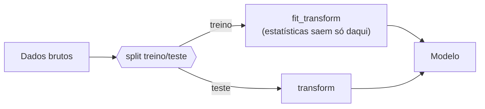

# 1. EDA — Análise Exploratória

!!! abstract "Entrega 1 de 3 do [Projeto](../index.md)"

    [Projects](https://insper.github.io/ann-dl/){:target='_blank'}

!!! info "Equipe"

    | Nome completo | E-mail | GitHub |
    |---------------|--------|--------|
    | Luana Prado Lopes Guimaraes | luanaplg@al.insper.edu.br | LuanaPLGuimaraes |
    | Laura Pontiroli Machado | laurapm@alinsper.edu.br | laupontiroli |

    Dataset, decisões e status: [página do projeto](../index.md).

!!! tip "O que esta entrega decide"

    O EDA não é um álbum de gráficos: é onde a equipe **escolhe o dataset** e descobre o que
    vai atrapalhar o treino depois — desbalanceamento, vazamento, escalas incompatíveis com a
    ativação, ausências não aleatórias. Cada achado aqui deve virar uma linha do plano de
    pré-processamento no fim da página, e é esse plano que as duas entregas
    seguintes executam.

    As aulas de **Classes → Data** no
    [site da disciplina](https://insper.github.io/ann-dl/){:target='_blank'} dão a estrutura:
    tipos, distribuições, qualidade, desbalanceamento, vazamento, split e pré-processamento.

## 1. Dataset

- **Nome:** Playground Series — Season 6, Episode 9 (Predicting Electric Vehicle Purchases)
- **Fonte:** Kaggle, competição "Playground Series S6E9"
- **Licença:** dataset sintético disponibilizado para a competição, uso autorizado para fins de estudo/competição conforme as regras do Playground Series
- **Dimensões:** 668.665 amostras no total, divididas em 534.932 (treino) e 133.733 (teste), split 80/20 estratificado pelo alvo, `random_state=42`. 13 features + `id` (identificador) + alvo `Will_Buy_EV`
- **Por que este dataset:** Dataset de competition interessante que se enquadrava como interesse pelas duas da dupla. Outros datasets foram considerados e analisados mas esse se destacou como maior interesse para ambas.

## 2. Estrutura e tipos

534.932 amostras no conjunto de treino, 13 features (fora `id` e o alvo).

| Feature | Tipo | Cardinalidade / faixa | Observação |
|---------|------|-----------------------|------------|
| id | Identificador | 534.932 valores únicos | Não é feature |
| Age | Numérica discreta | 45 valores únicos | Idade em anos inteiros |
| Annual_Income_USD | Numérica contínua | 12.406 valores únicos | Alta granularidade, renda |
| Daily_Commute_km | Numérica contínua | 794 valores únicos | Distância de deslocamento diário |
| Number_of_Cars_Owned | Numérica discreta | 4 valores únicos | Contagem de carros |
| Charging_Stations_Near_Home | Numérica discreta | 15 valores únicos | Contagem |
| Charging_Stations_Near_Work | Numérica discreta | 20 valores únicos | Contagem |
| Environmental_Concern_Level | Ordinal discreta | 5 níveis (1–5) | Lida como `float64` pelo pandas, mas é escala ordenada, não contínua |
| Gender | Categórica nominal | Female, Male, Other | Sem ordem natural |
| City_Type | Categórica nominal | Suburban, Urban, Rural | Sem ordem adotada |
| Current_Car_Type | Categórica nominal | SUV, Sedan, Truck, Hatchback | Sem ordem natural |
| Home_Charging_Possible | Categórica binária | 2 categorias (Yes/No) | - |
| Subsidy_Available | Categórica binária | 2 categorias (Yes/No) | - |
| Range_Anxiety_Level | Categórica ordinal | Low, Medium, High | Lida como `object` pelo pandas |

## 3. Variável alvo

- **Proporção por classe:** `No` = 82,54% / `Yes` = 17,46%
- **Razão entre maior e menor classe:** = 4,73
- **Baseline:** um classificador que sempre responde `No` acerta **82,54%** — esse é o número que a entrega de classificação precisa superar

/// continuar daqui 

- **Classificação:** proporção por classe, razão entre a maior e a menor.
- **Regressão:** distribuição, assimetria, cauda, presença de zeros ou censura.

/// caption
**Figura 1** — Distribuição da variável alvo.
///

!!! question "Responda"

    O quão desbalanceado está? Um classificador que sempre responde a classe majoritária
    acerta quantos por cento? Esse número é o seu *baseline* — as entregas seguintes precisam
    superá-lo.

## 4. Análise univariada

Distribuição de cada feature relevante: medidas de posição e dispersão, e o formato.
Não gere 40 histogramas; escolha os que mudam alguma decisão e explique o critério.

## 5. Análise bivariada e correlações

Relação entre as features e o alvo, e entre as features.

!!! danger "Correlação alta demais com o alvo é suspeita"

    Uma feature que prevê o alvo quase perfeitamente costuma ser **vazamento**: informação
    que só existe depois do fato que você quer prever. Investigue antes de comemorar.

## 6. Qualidade dos dados

### Valores ausentes

| Feature | % ausente | Padrão (aleatório?) | Tratamento planejado |
|---------|-----------|---------------------|----------------------|
| | | | |

Ausência raramente é aleatória. Se falta mais em um grupo do que em outro, o próprio "estar
ausente" carrega informação.

### Duplicatas e inconsistências

Linhas repetidas, categorias escritas de formas diferentes, unidades misturadas, datas
impossíveis.

### Outliers

Como foram detectados e o que será feito com eles — e por quê. Remover outlier é decisão de
modelagem, não faxina.

## 7. Riscos de vazamento

Liste as fontes de vazamento identificadas e como cada uma será contida.

| Risco | Onde aparece | Contenção |
|-------|--------------|-----------|
| Estatísticas calculadas antes do split | | Ajustar transformadores só no treino |
| | | |

## 8. Plano de pré-processamento

A saída desta entrega. Uma linha por transformação, ligando cada uma a um achado acima.

| # | Transformação | Features | Motivo (seção) |
|---|---------------|----------|----------------|
| 1 | | | |

## 9. Estratégia de split

Proporções, estratificação, e o que impede uma mesma entidade de cair nos dois lados
(agrupamento por usuário, por data, por sessão).

## Results summary

| # | Métrica | Valor |
|---|---------|-------|
| 1 | Amostras | |
| 2 | Features (antes / depois do encoding) | |
| 3 | Features com ausentes | |
| 4 | Maior % de ausência em uma feature | |
| 5 | Linhas duplicadas | |
| 6 | Razão de desbalanceamento do alvo | |
| 7 | Acurácia (ou erro) do baseline trivial | |
| 8 | Maior correlação feature–alvo | |
| 9 | Amostras treino / teste após o split | |

## Conclusão

O que o dataset permite e o que ele impede. Se algum achado inviabiliza a tarefa pretendida,
é aqui que a equipe muda de rumo — ainda dá tempo.

## Referências
