# 1. EDA — Análise Exploratória

!!! abstract "Entrega 1 de 3 do [Projeto](../index.md)"

    [Projects](https://insper.github.io/ann-dl/){:target='_blank'}

!!! info "Equipe"

    | Nome completo | E-mail | GitHub |
    |---------------|--------|--------|
    | Luana Prado Lopes Guimaraes | luanaplg@al.insper.edu.br | LuanaPLGuimaraes |
    | Laura Pontiroli Machado | laurapm@alinsper.edu.br | laupontiroli |

    Dataset, decisões e status: [página do projeto](../index.md).


## 1. Dataset

- **Nome:** Playground Series — Season 6, Episode 9 (Predicting Electric Vehicle Purchases)
- **Fonte:** Kaggle, competição "Playground Series S6E9"
- **Licença:** dataset sintético disponibilizado para a competição, uso autorizado para fins de estudo/competição conforme as regras do Playground Series
- **Dimensões:** 668.665 amostras no total, divididas em 534.932 (treino) e 133.733 (teste), split 80/20 estratificado pelo alvo, `random_state=42`. 13 features + `id` (identificador) + alvo `Will_Buy_EV`
- **Por que este dataset:** Dataset de competition interessante que se enquadrava como interesse pelas duas da dupla. Outros datasets foram considerados e analisados mas esse se destacou como maior interesse para ambas.

## 2. Estrutura e tipos

534.932 amostras no conjunto de treino, 13 features (fora `id` e o alvo).

| Feature | Tipo | Cardinalidade / faixa | Observação |
|---------|------|-----------------------|------------|
| id | Identificador | 534.932 valores únicos | Não é feature |
| Age | Numérica discreta | 45 valores únicos | Idade em anos inteiros |
| Annual_Income_USD | Numérica contínua | 12.406 valores únicos | Alta granularidade, renda |
| Daily_Commute_km | Numérica contínua | 794 valores únicos | Distância de deslocamento diário |
| Number_of_Cars_Owned | Numérica discreta | 4 valores únicos | Contagem de carros |
| Charging_Stations_Near_Home | Numérica discreta | 15 valores únicos | Contagem |
| Charging_Stations_Near_Work | Numérica discreta | 20 valores únicos | Contagem |
| Environmental_Concern_Level | Ordinal discreta | 5 níveis (1–5) | Lida como `float64` pelo pandas, mas é escala ordenada, não contínua |
| Gender | Categórica nominal | Female, Male, Other | Sem ordem natural |
| City_Type | Categórica nominal | Suburban, Urban, Rural | Sem ordem adotada |
| Current_Car_Type | Categórica nominal | SUV, Sedan, Truck, Hatchback | Sem ordem natural |
| Home_Charging_Possible | Categórica binária | 2 categorias (Yes/No) | - |
| Subsidy_Available | Categórica binária | 2 categorias (Yes/No) | Possível risco de vazamento — retomar na seção de riscos |
| Range_Anxiety_Level | Categórica ordinal | Low, Medium, High | Lida como `object` pelo pandas |


## 3. Variável alvo

- **Proporção por classe:** `No` = 82,54% / `Yes` = 17,46%
- **Razão entre maior e menor classe:** ≈ 4,73
- **Baseline:** um classificador que sempre responde `No` acerta **82,54%** — a classificação precisa superar esse valor

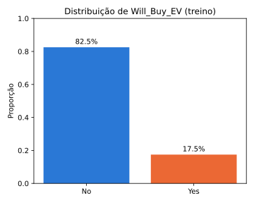
/// caption
**Figura 1** — Distribuição da variável alvo (`Will_Buy_EV`) no conjunto de treino.
///

O alvo está desbalanceado numa razão de aproximadamente 4,73:1 entre as classes `No` e
`Yes`. Um classificador trivial que sempre responde `No` (a classe majoritária) já acerta
82,54% das amostras sem aprender nada sobre os dados, sendo esse o nosso *baseline*. Qualquer
modelo de classificação treinado nas próximas entregas só tem valor real se superar essa
acurácia; caso contrário, ele não está aprendendo nada além da proporção das classes.

## 4. Análise univariada

### Medidas de posição e dispersão

| Feature | mean | std | min | 25% | 50% | 75% | max |
|---|---|---|---|---|---|---|---|
| Age | 47,02 | 12,87 | 25,0 | 36,0 | 47,0 | 58,0 | 69,0 |
| Annual_Income_USD | 84.754,35 | 28.623,91 | 30.000,0 | 67.380,0 | 84.870,0 | 102.751,0 | 188.549,0 |
| Daily_Commute_km | 32,15 | 18,73 | 5,0 | 17,2 | 33,6 | 47,4 | 98,7 |
| Number_of_Cars_Owned | 1,71 | 0,73 | 1,0 | 1,0 | 2,0 | 2,0 | 4,0 |
| Charging_Stations_Near_Home | 4,96 | 3,93 | 0,0 | 2,0 | 4,0 | 7,0 | 14,0 |
| Charging_Stations_Near_Work | 7,17 | 5,18 | 0,0 | 3,0 | 6,0 | 10,0 | 19,0 |
| Environmental_Concern_Level | 2,93 | 1,43 | 1,0 | 2,0 | 3,0 | 4,0 | 5,0 |

### Formato (histogramas)

Das 7 features acima, só 3 têm alta cardinalidade (`Age` = 45 valores únicos,
`Annual_Income_USD` = 12.406, `Daily_Commute_km` = 794), essas são as únicas cujo formato
torna mais difícil de entender apenas pela tabela de posição/dispersão acima, por isso elas recebem
histograma individual. As demais, por terem poucos valores distintos, já estão descritas pela tabela.

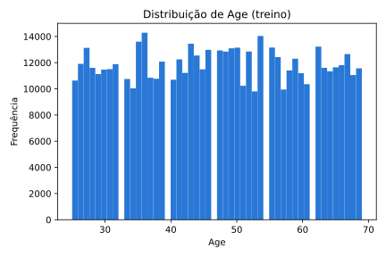
/// caption
**Figura 2** — Distribuição de `Age` no conjunto de treino.
///

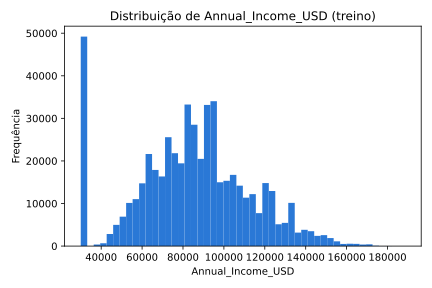
/// caption
**Figura 3** — Distribuição de `Annual_Income_USD` no conjunto de treino.
///

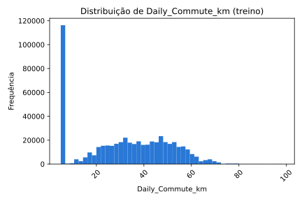
/// caption
**Figura 4** — Distribuição de `Daily_Commute_km` no conjunto de treino.
///

- **`Age`**: distribuição aproximadamente uniforme entre 25 e 69 anos, sem assimetria nem
  concentração em nenhuma faixa específica.
- **`Annual_Income_USD`**: formato com leve assimetria à direita, mas com uma concentração
  anômala de 9,20% das amostras exatamente no valor mínimo (30.000), destoando do restante
  da curva.
- **`Daily_Commute_km`**: mesmo padrão, de forma ainda mais intensa, 21,59% das amostras
  caem exatamente no valor mínimo (5,0 km), o que é  improvável para uma medida contínua de distância.

!!! warning "Achado: valor mínimo pode ser não-resposta disfarçada"

    As concentrações exatas no valor mínimo em `Annual_Income_USD` e `Daily_Commute_km`
    não aparecem como `NaN`, mas o padrão (pico isolado, exatamente no piso da
    escala, destoa do resto da distribuição) sugere que esses valores representam
    respostas ausentes definidas como o mínimo da escala, em vez de dados reais. A hipótese é testada na Seção 6.3 e o tratamento está na Seção 8.

## 5. Análise bivariada e correlações


Todas as estatísticas desta seção foram calculadas **só no conjunto de treino** (534.932 linhas).
A taxa geral de `Yes` no treino é **17,46%** (Seção 3), e é a referência de todas as comparações abaixo.

### 5.A Numérica × numérica

**Método.** Usamos a correlação de **Spearman**. Quatro das sete numéricas são contagens ou escalas
ordinais (`Number_of_Cars_Owned`, `Charging_Stations_Near_Home`, `Charging_Stations_Near_Work`,
`Environmental_Concern_Level`), e `Annual_Income_USD` e `Daily_Commute_km` têm picos
exatamente no valor mínimo (9,20% e 21,59%, Seção 4) que distorcem Pearson. Spearman mede relação
monotônica sem supor normalidade e é menos sensível a esses picos. Na prática os dois métodos
concordam: o par mais correlacionado tem ρ = +0,543 (Spearman) e r = +0,510 (Pearson), e as demais
células diferem em no máximo 0,03.

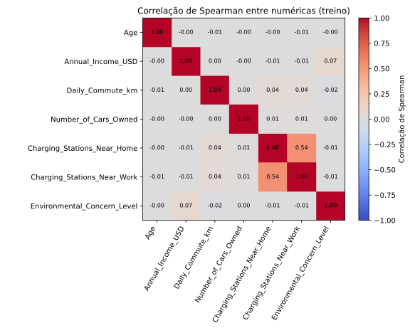
/// caption
**Figura 5** — Correlação de Spearman entre as 7 numéricas (treino).
///

**Conclusão (Fig. 5).** O par mais correlacionado é **`Charging_Stations_Near_Home` ×
`Charging_Stations_Near_Work` (ρ = +0,543)**. É uma correlação moderada, **abaixo do limiar de 0,7** que
usamos para chamar um par de redundante: nenhum dos 21 pares passa dele. O segundo maior é
`Annual_Income_USD` × `Environmental_Concern_Level` (ρ = +0,075), e todos os demais ficam abaixo de
|0,05|. Portanto **não removemos nenhuma numérica por redundância**; as duas contagens de estações de
carregamento ficam, porque cada uma tem relação quase nula com o alvo (ρ = −0,022 e −0,014) e a
colinearidade moderada não prejudica uma rede neural.


/// caption
**Figura 6** — Dispersão dos 3 pares numéricos mais correlacionados (amostra de 5.000 linhas do treino).
///

**Conclusão (Fig. 6).** No par das estações de carregamento a nuvem
mostra tendência positiva, em grade, porque as duas variáveis são contagens inteiras; nos outros dois pares
(ρ = +0,075 e +0,043) não há padrão visível. Isso **confirma** a conclusão da Figura 5: só um par tem
relação apreciável, e ela é moderada.

**Correlação com o alvo.** As numéricas mais associadas a `Will_Buy_EV` são
**`Environmental_Concern_Level` (ρ = +0,461)** e **`Annual_Income_USD` (ρ = +0,224)**.
`Daily_Commute_km` tem ρ = −0,044 e as quatro restantes têm |ρ| ≤ 0,022, isto é, nenhuma
associação monotônica detectável com o alvo individualmente.

### 5.B Categórica × alvo

Em cada figura, a linha tracejada é a taxa geral de `Yes` (17,46%). Barras longe dela indicam
categorias que mudam a probabilidade de compra.

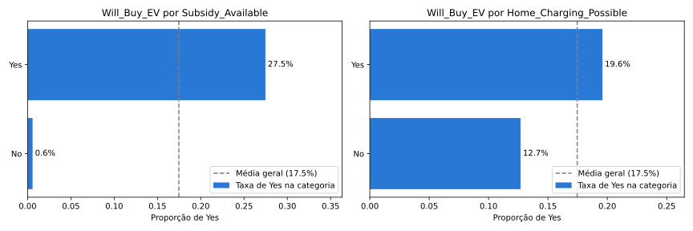
/// caption
**Figura 7** — Proporção de `Yes` por categoria de `Subsidy_Available` e `Home_Charging_Possible`.
///

**Conclusão (Fig. 7).**

- **`Subsidy_Available`:** sem subsídio (198.952 linhas) a taxa de `Yes` é de apenas **0,57%**; com
  subsídio (335.980 linhas) é de **27,47%**, cerca de 48 vezes maior. Estimamos, a partir dessas taxas e
  contagens, que cerca de 99% dos compradores do treino têm subsídio disponível. Praticamente ninguém compra
  sem ele, o que faz dessa a feature categórica mais forte do dataset.
- **`Home_Charging_Possible`:** 12,69% sem carregador em casa contra 19,59% com ele (+6,9 p.p., ×1,54).
  É um efeito real, mas moderado.

**Decisão sobre `Subsidy_Available`.** Não a classificamos como vazamento, porque **não é derivada do
alvo**: a descrição do dataset original a trata como um 
fator econômico do comprador, não resultado da compra (Seção 7).
É uma condição que existe antes da decisão de compra
e tem leitura econômica direta. Mas a relação é tão forte que o modelo pode se apoiar quase só nela e
mascarar as outras features. Por isso **vamos treinar com e sem `Subsidy_Available`** na entrega de
Classificação e comparar as métricas. O `preprocess.py` já aceita as duas versões (`use_subsidy=True/False`).

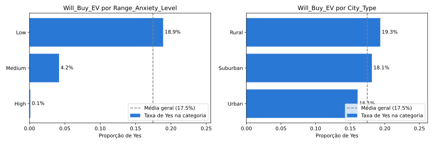
/// caption
**Figura 8** — Proporção de `Yes` por `Range_Anxiety_Level` e `City_Type`.
///

**Conclusão (Fig. 8).**

- **`Range_Anxiety_Level`:** a taxa cai de **18,90%** (Low, 483.239 linhas, 90,3% do treino) para
  **4,18%** (Medium, 49.920 linhas) e **0,11%** (High, 1.773 linhas). A relação é monotônica e quase
  determinística nos níveis Medium e High: quem tem ansiedade de autonomia acima de Low praticamente nunca
  compra.
- **Decisão: descartamos `Range_Anxiety_Level`.** (a descrição do dataset original a trata como um segundo alvo, seção 7). Uma feature construída a partir do que
  queremos prever carrega o rótulo para dentro do modelo e inflaria as métricas sem generalizar. Ela fica
  visível nesta figura só como evidência da decisão; fora desta seção, não entra em nenhum modelo nem nas projeções
  PCA, t-SNE e UMAP.
- **`City_Type`:** Rural 19,34%, Suburban 18,13%, Urban 16,07%. A amplitude é de **3,27 p.p.**, efeito
  pequeno.

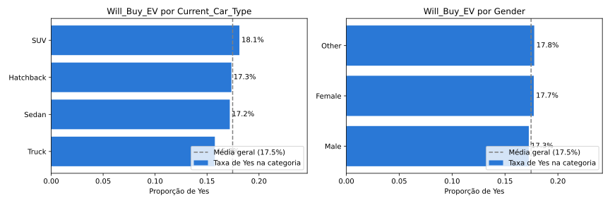
/// caption
**Figura 9** — Proporção de `Yes` por `Current_Car_Type` e `Gender`.
///

**Conclusão (Fig. 9).** `Current_Car_Type` varia de 15,75% (Truck) a 18,12% (SUV), amplitude de
**2,37 p.p.**, e `Gender` varia de 17,25% (Male) a 17,76% (Other), apenas **0,51 p.p.** Nenhuma das duas
tem poder preditivo relevante sozinha. `Gender = Other` tem só 4.250 linhas (0,8% do treino), então a taxa dessa
categoria é a menos estável.

### 5.C Numérica × categórica

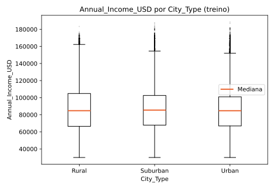
/// caption
**Figura 10** — `Annual_Income_USD` por `City_Type` (treino).
///

**Conclusão (Fig. 10).** As medianas são praticamente iguais: Rural 84.768, Suburban 85.475 e
Urban 84.748 (diferença máxima de 727, menos de 1%). O espalhamento difere pouco: o IQR é de 38.422 em
Rural contra 34.738 em Suburban e 34.091 em Urban (de 10% a 13% maior em Rural). Os grupos **não diferem em
posição e diferem levemente em espalhamento**, com a zona rural mais dispersa. A renda não depende do
tipo de cidade.

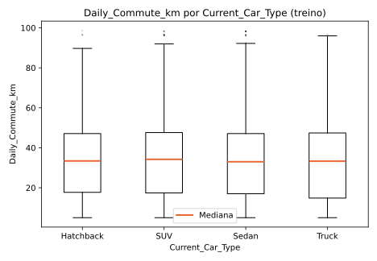
/// caption
**Figura 11** — `Daily_Commute_km` por `Current_Car_Type` (treino).
///

**Conclusão (Fig. 11).** As medianas ficam entre 33,0 km (Sedan) e 34,2 km (SUV), amplitude de 1,2 km. O IQR
vai de 29,40 (Hatchback) a 32,57 (Truck), e o desvio-padrão de 18,56 a 19,20. Os grupos **não diferem em
posição e quase não diferem em espalhamento**; Truck é o mais disperso. Os 21,59% de linhas no
piso de 5,0 km estão em todos os grupos e achatam o limite inferior das caixas.

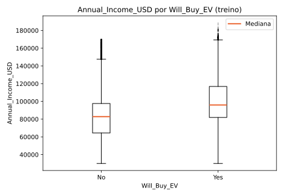
/// caption
**Figura 12** — `Annual_Income_USD` por `Will_Buy_EV` (treino).
///

**Conclusão (Fig. 12).** A mediana da renda é **95.966** para `Yes` (93.423 linhas) e **82.823** para `No` (441.509 linhas), uma diferença de 13.143 (cerca de 16% maior entre compradores). O espalhamento é parecido: IQR de 34.987 contra 33.258 e desvio-padrão de 26.273 contra 28.217. Os grupos diferem **em posição, não em espalhamento**: quem compra tem renda mediana mais alta, mas a variabilidade é a mesma. Isso é coerente com ρ = +0,224 entre renda e alvo (Seção 5.A), uma associação real porém moderada, já que as duas caixas se sobrepõem bastante.

### 5.D Síntese da seção

- **Sem redundância forte entre numéricas.** O maior ρ é 0,543 (estações de carregamento em casa e no
  trabalho), abaixo de 0,7; nenhuma numérica é removida por correlação (Fig. 5).
- **O sinal numérico está em `Environmental_Concern_Level` (ρ = +0,461) e `Annual_Income_USD`
  (ρ = +0,224).** Compradores têm renda mediana de 95.966 contra 82.823 dos não compradores (Fig. 12).
  As demais numéricas têm |ρ| ≤ 0,044 com o alvo.
- **`Range_Anxiety_Level` é descartada** (derivada do alvo): 0,11% de `Yes` em High e 4,18% em Medium
  (Fig. 8).
- **`Subsidy_Available` é a categórica mais forte** (0,57% contra 27,47%, Fig. 7), mas não é derivada
  do alvo; será testada com e sem na Classificação.
- **`Gender`, `City_Type` e `Current_Car_Type` têm efeito pequeno** (amplitudes de 0,51, 3,27 e 2,37 p.p.,
  Figs. 8 e 9), e renda e deslocamento não variam com cidade ou carro (Figs. 10 e 11).
- **Implicação para a modelagem:** o desbalanceamento (17,46% de `Yes`) e a dependência de poucas features
  (`Subsidy_Available`, `Environmental_Concern_Level`, `Annual_Income_USD`) são os riscos principais.
  Comparar o desempenho com e sem `Subsidy_Available` mostra quanto o modelo depende dela.


## 6. Qualidade dos dados

Todos os números desta seção são do conjunto de **treino** (534.932 linhas, 15 colunas incluindo `id` e o alvo).
O teste só entra na checagem de categorias novas.

### 6.1 Valores ausentes

| Feature | Ausentes | % ausente | Padrão | Tratamento planejado |
|---------|----------|-----------|--------|----------------------|
| Todas as 15 colunas | 0 | 0,00% | não se aplica | nenhum (o pipeline mantém um `SimpleImputer` por segurança) |

**Nenhuma coluna tem valores ausentes**, então a coluna com mais faltantes tem 0 linhas (0,00%).
Isso não significa que os dados estejam completos: os pisos de renda e deslocamento (Seção 6.3) não aparecem como
`NaN` e foram investigados à parte.

### 6.2 Duplicatas e inconsistências

| Verificação | Resultado |
|-------------|-----------|
| Linhas duplicadas (todas as colunas) | 0 (0,00%) |
| Linhas duplicadas ignorando o `id` (features + alvo) | 0 (0,00%) |
| `id` | 534.932 valores únicos em 534.932 linhas (todos distintos) |
| Colunas constantes | nenhuma |
| Valores impossíveis (idade fora de 18–110, renda ≤ 0, deslocamento < 0 ou > 500 km, contagens < 0, `Environmental_Concern_Level` fora de 1–5) | 0 linhas em todas as regras |
| Valores não inteiros em colunas de contagem (`Age`, `Number_of_Cars_Owned`, `Charging_Stations_*`, `Environmental_Concern_Level`) | 0 |
| Categóricas com grafias duplicadas (após `strip` e `lower`) ou placeholders (`Unknown`, `N/A`, `?`) | nenhuma |
| Categorias no teste ausentes do treino | nenhuma, nas 6 categóricas |

Os limites de "valor impossível" são critérios nossos, de bom senso, e não faixas oficiais do dataset. O fato de nenhuma categoria nova aparecer no teste não elimina `handle_unknown="ignore"`
no encoding: mantemos para o caso de o modelo receber dados novos, como o `test.csv` da competição.

### 6.3 Valores no piso

`Annual_Income_USD` tem **49.191 linhas (9,20%)** exatamente em 30.000, e `Daily_Commute_km` tem
**115.506 linhas (21,59%)** exatamente em 5,0 km (Seção 4). Nenhuma das duas colunas tem `NaN`. Testamos a hipótese de
que esses valores sejam respostas ausentes disfarçadas no mínimo da escala, comparando a taxa de `Yes` dentro e fora do piso:

| Feature | Linhas no piso | `Yes` no piso | `Yes` fora do piso | `Yes` geral |
|---------|----------------|---------------|--------------------|-------------|
| `Annual_Income_USD` (30.000) | 49.191 (9,20%) | **4,41%** | 18,79% | 17,46% |
| `Daily_Commute_km` (5,0 km) | 115.506 (21,59%) | 18,43% | 17,20% | 17,46% |

Nos dois pisos ao mesmo tempo estão 11.018 linhas (2,06%). Se os dois pisos fossem independentes, esperaríamos
cerca de 10.600. Em pelo menos um piso estão 153.679 linhas (28,73%).

**O que isso mostra.**

- **Renda.** A taxa de `Yes` no piso (4,41%) é quatro vezes menor que fora dele (18,79%). Uma não-resposta aleatória
  teria taxa perto da geral (17,46%). O grupo do piso se comporta como pessoas de renda baixa, o que é coerente com a
  correlação de +0,224 entre renda e alvo (Seção 5.A) e com valores truncados no mínimo. Portanto **esse grupo é informativo**, e o tratamento precisa preservar a informação de estar no piso (indicador, abaixo).
- **Deslocamento.** A taxa no piso (18,43%) é próxima da de fora (17,20%), e o deslocamento quase não se relaciona com o
  alvo (ρ = −0,044). Não há evidência de que o piso seja diferente das demais linhas.
- **Independência dos pisos.** O número de linhas nos dois pisos (11.018) é quase o esperado sob independência (cerca de
  10.600). Isso é contra a ideia de um respondente que pulou vários campos de uma vez.

**Conclusão e revisão do achado da Seção 4.** A hipótese de "não-resposta aleatória" **não se sustenta**: na renda, a taxa de `Yes` no piso (4,41%) é muito diferente da de fora dele (18,79%), e no deslocamento a diferença é pequena (18,43% contra 17,20%). O mais provável é que os valores tenham sido truncados no mínimo da escala, mas isso é uma interpretação, não uma prova: não temos o gerador do dataset. Como não sabemos se o piso é um valor real ou um código de ausência, adotamos um tratamento que funciona nas duas leituras (Seção 8): **o piso vira `NaN`, é imputado pela mediana do treino e ganha um indicador binário "estava no piso"** para cada uma das duas colunas. O indicador preserva a informação de estar no piso, que é o sinal que o grupo carrega, e a imputação só retira da escala numérica o valor constante (30.000 ou 5,0 km), que distorceria o escalonamento.

### 6.4 Outliers

Método: **IQR com k = 1,5** (limites Q1 − 1,5·IQR e Q3 + 1,5·IQR), calculado no treino.

| Feature | Limites | Outliers | % do treino |
|---------|---------|----------|-------------|
| `Age` | [3,00; 91,00] | 0 | 0,00% |
| `Annual_Income_USD` | [14.323,50; 155.807,50] | 2.926 | 0,55% |
| `Daily_Commute_km` | [−28,10; 92,70] | 37 | 0,01% |
| `Number_of_Cars_Owned` | [−0,50; 3,50] | 10.725 | 2,00% |
| `Charging_Stations_Near_Home` | [−5,50; 14,50] | 0 | 0,00% |
| `Charging_Stations_Near_Work` | [−7,50; 20,50] | 0 | 0,00% |
| `Environmental_Concern_Level` | [−1,00; 7,00] | 0 | 0,00% |

- **Renda e deslocamento:** são contínuas, e os outliers são caudas altas (renda máxima 188.549, deslocamento máximo
  98,7 km), sem valores absurdos. **Winsorizamos** nos limites do IQR, em vez de remover linhas: são poucas e o
  `StandardScaler`, que usaremos por causa da rede neural, é sensível a caudas. Como as linhas no piso viram `NaN`
  antes (Seção 6.3), os limites usados no pipeline são calculados **sem elas**, o que os estreita: renda
  [24.950,00; 152.806,00] (4.250 linhas, 0,79% do treino) e deslocamento [−2,90; 81,90] (155 linhas, 0,03%).
  Remover linhas seria uma decisão de modelagem, e não vemos erro de dado que a justifique.
- **`Number_of_Cars_Owned`:** os 10.725 "outliers" são todos os que têm **4 carros**. A regra do IQR não se aplica a uma variável
  discreta com 4 valores e IQR de 1: o valor 4 é legítimo. **Não tratamos.**
- **Idade, estações e preocupação ambiental:** nenhum outlier.
- **Linhas afetadas pela estratégia de outliers:** **4.405 linhas (0,82% do treino)** têm algum valor winsorizado
  (4.250 por renda e 155 por deslocamento, sem sobreposição). Além disso, 153.679 linhas (28,73%) têm pelo menos
  um valor no piso, tratado como `NaN` e imputado (Seção 6.3).

### 6.5 Colunas descartadas

| Coluna | Motivo | Evidência |
|--------|--------|-----------|
| `id` | Identificador, não é feature | 534.932 valores únicos em 534.932 linhas |
| `Range_Anxiety_Level` | Derivada do alvo (vazamento) | Descrição do dataset original no Kaggle (Seção 7); `Yes` em 18,90% (Low), 4,18% (Medium) e 0,11% (High), Seção 5.B |
| (nenhuma constante) | | 0 colunas constantes |

`Subsidy_Available` **não** é descartada: tem relação muito forte com o alvo (0,57% contra 27,47% de `Yes`), mas não é
derivada dele. Será treinada com e sem a coluna na entrega de Classificação (Seção 5.B).


## 7. Riscos de vazamento

| Risco | Onde aparece | Evidência | Contenção |
|-------|--------------|-----------|-----------|
| Estatísticas calculadas antes do split | Qualquer estatística (média, desvio, quantis) usada pra normalizar/imputar | — | Ajustar (`fit`) transformadores só no treino (Seção 8) |
| `Subsidy_Available` — forte preditor, talvez suspeita de vazamento | Taxa de `Will_Buy_EV`: 27,5% (`Yes`) vs 0,5% (`No`) — quase separação total | A descrição do dataset original no Kaggle lista "disponibilidade de subsídio" como fator econômico do comprador (junto com preocupação ambiental), não como resultado da compra — reduz a suspeita de vazamento literal, pode ser apenas uma feature de forte impacto | Manter como feature, mas documentar a ressalva; monitorar se o modelo de classificação depende dela de forma desproporcional |
| `Range_Anxiety_Level`: derivada do alvo | Taxa de `Yes`: 18,90% (Low), 4,18% (Medium) e 0,11% (High) (Fig. 8), quase determinística | A descrição do dataset original trata essa variável como um segundo alvo, calculado pelo mesmo processo que gera `Will_Buy_EV`, e não como feature de entrada independente. O padrão quase determinístico é consistente com isso, mas não é uma prova, porque não temos o gerador | **Descartada:** não entra no pipeline nem nas projeções PCA, t-SNE e UMAP (Seções 5.B, 6.5 e 8) |

## 8.1 Plano de pré-processamento

Cada transformação foi escolhida a partir de um achado das seções anteriores, e **todas as estatísticas (mediana, piso,
limites do IQR, média, desvio e categorias) são aprendidas só no treino** e apenas aplicadas no teste. O destino é uma
rede neural, que exige entradas numéricas, sem `NaN` e em escalas comparáveis.

| # | Transformação | Features | Motivo (seção) |
|---|---------------|----------|----------------|
| 1 | Descartar a coluna | `id` | Identificador: 534.932 valores únicos em 534.932 linhas (Seção 6.5) |
| 2 | Descartar a coluna | `Range_Anxiety_Level` | Risco de vazamento: derivada do alvo (Seções 5.B, 6.5 e 7) |
| 3 | Valor no piso vira `NaN`, é imputado pela mediana do treino e ganha um indicador "estava no piso" | `Annual_Income_USD`, `Daily_Commute_km` | 9,20% e 21,59% das linhas no piso; na renda, esse grupo tem 4,41% de `Yes` contra 18,79% fora dele, então estar no piso é informativo (Seção 6.3) |
| 4 | Winsorização pelo IQR (k = 1,5), com limites do treino calculados sem as linhas do piso | `Annual_Income_USD`, `Daily_Commute_km` | Caudas altas e poucas linhas afetadas (4.405, 0,82%); remover linhas seria decisão de modelagem (Seção 6.4) |
| 5 | Imputação pela mediana, por segurança | `Age`, `Number_of_Cars_Owned`, `Charging_Stations_Near_Home`, `Charging_Stations_Near_Work`, `Environmental_Concern_Level` | Sem ausentes no treino (Seção 6.1); evita erro se dados novos vierem com `NaN` |
| 6 | Padronização (`StandardScaler`) | As 7 numéricas e os 2 indicadores de piso | As escalas são muito diferentes (renda de 30.000 a 188.549, `Environmental_Concern_Level` de 1 a 5, Seção 4) e a rede neural é sensível a isso |
| 7 | One-hot (uma coluna só se for binária) com `handle_unknown="ignore"` | `Gender`, `City_Type`, `Current_Car_Type`, `Home_Charging_Possible`, `Subsidy_Available` | Categóricas nominais, sem ordem (Seção 2). Nenhuma categoria nova no teste (Seção 6.2), mas mantemos o `ignore` por segurança. Geram 12 colunas |

### 8.2 PCA

A PCA foi ajustada nas 21 colunas escalonadas do treino inteiro (534.932 linhas). O gráfico de dispersão usa uma amostra estratificada de 10.000 linhas do treino.

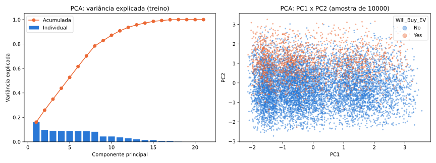
/// caption
**Figura 13** — PCA das features escalonadas do treino: variância explicada (esquerda) e amostra de 10.000 linhas em PC1 × PC2, colorida por `Will_Buy_EV` (direita).
///

**Variância explicada.** PC1 e PC2 juntos explicam **25,90%** da variância (16,11% e 9,79%). São necessários **9 componentes para 80%**, **11 para 90%** e **13 para 95%**. De PC3 a PC8 cada componente explica quase o mesmo (cerca de 9%): a variância está espalhada em muitas direções, o que combina com as correlações baixas entre as features (Seção 5.A). PC19 a PC21 têm variância zero porque as colunas one-hot de cada categórica somam 1, ou seja, são redundantes.

**Loadings.** PC1 é dominada por `Charging_Stations_Near_Home` (+0,638), `Charging_Stations_Near_Work` (+0,638) e `City_Type_Urban` (+0,308): é o eixo da infraestrutura de carregamento. PC2 é dominada por `Environmental_Concern_Level` (+0,645), `Annual_Income_USD` (+0,634) e pelo indicador de piso da renda (−0,377): é o eixo de preocupação ambiental e renda. PC3 combina `Daily_Commute_km` (+0,651) com os indicadores de piso da renda (−0,490) e do deslocamento (−0,347).

**Conclusão (Fig. 13).** Na projeção PC1 × PC2, os compradores (`Yes`) se concentram na parte de cima, onde PC2 é alto, isto é, onde a preocupação ambiental e a renda são maiores. Isso é coerente com as correlações com o alvo da Seção 5.A (ρ = +0,461 e +0,224). Mas os dois grupos se sobrepõem bastante, e ao longo de PC1 não há separação visível. Como duas componentes guardam só 25,90% da variância, essa projeção mostra apenas parte da estrutura dos dados.

### 8.3 t-SNE e UMAP

As duas projeções usam a mesma amostra estratificada de 10.000 linhas do treino (17,46% de `Yes`, como no treino inteiro), com `random_state=42`. Usamos 2 valores de `perplexity` no t-SNE (30 e 50; divergência KL final de 2,1506 e 2,1063) e 2 valores de `n_neighbors` no UMAP (15 e 50, com `min_dist=0,1`). Nesses métodos, o tamanho dos grupos e a distância entre eles não têm leitura direta, e a classe `Yes` é desenhada por cima da `No`, então pode esconder pontos azuis.


/// caption
**Figura 14** — t-SNE de uma amostra de 10.000 linhas do treino, com `perplexity` 30 (esquerda) e 50 (direita), colorida por `Will_Buy_EV`.
///

**Conclusão (Fig. 14).** Os dois valores de `perplexity` mostram a mesma estrutura: vários grupos separados, com posições e formas parecidas, então o resultado é estável ao parâmetro. Dentro de cada grupo, `Yes` e `No` aparecem misturados, mas a proporção de `Yes` varia de um grupo para outro: os grupos pequenos da parte de baixo têm quase só `No`.


/// caption
**Figura 15** — UMAP de uma amostra de 10.000 linhas do treino, com `n_neighbors` 15 (esquerda) e 50 (direita), colorida por `Will_Buy_EV`.
///

**Conclusão (Fig. 15).** O UMAP também forma ilhas separadas. Com `n_neighbors=15` elas aparecem mais espalhadas e com `n_neighbors=50` ficam mais juntas e compactas, o que mostra que o arranjo dos grupos depende do parâmetro. Em todas as ilhas `Yes` e `No` convivem.

**O que as projeções não lineares revelam que a PCA não mostra.** A PCA mostra uma única nuvem contínua; o t-SNE e o UMAP revelam que os dados formam **grupos separados**, que provavelmente correspondem a combinações das variáveis categóricas (por exemplo, subsídio, carregador em casa e tipo de cidade). Essa explicação é uma hipótese, que não testamos aqui. Mas nas três projeções os compradores não formam um grupo próprio: o `Yes` está espalhado dentro dos grupos, com proporção maior em algumas regiões. Concluímos que, nessas projeções de 2 dimensões, as classes se sobrepõem bastante e a tarefa não será de separação fácil. Um modelo não linear pode aproveitar as diferenças de proporção entre regiões, mas não se deve esperar uma separação limpa, e o desbalanceamento (17,46% de `Yes`) reforça que a acurácia sozinha não basta.

### 8.4 Pipeline

O pré-processamento está em `code/preprocess.py`, um arquivo importável. Ele monta um `ColumnTransformer` com três ramos, e cada ramo é um `Pipeline` do scikit-learn: (1) renda e deslocamento (piso, winsorização, imputação com indicador e padronização), (2) as outras cinco numéricas (imputação e padronização) e (3) as cinco categóricas (one-hot). O ajuste (`fit`) é feito só no treino, e o teste só é transformado:

```python
from eda import load_split
from preprocess import build_preprocessor, prepare_xy

train_df, test_df = load_split()
X_train, y_train = prepare_xy(train_df)
X_test, y_test = prepare_xy(test_df)

pre = build_preprocessor()
X_train_t = pre.fit_transform(X_train)   # fit só no treino
X_test_t = pre.transform(X_test)         # teste apenas transformado
```

O parâmetro `use_subsidy=False` gera a versão sem `Subsidy_Available`, que será usada na comparação da entrega de Classificação (Seção 5.B).

**Resultado.**

- **Features:** entram 12 (as 13 originais menos `Range_Anxiety_Level`; `id` e o alvo já são separados) e saem **21 colunas**: 7 numéricas, 2 indicadores de piso e 12 colunas de categorias.
- **Shape:** treino **(534.932; 21)** e teste **(133.733; 21)**.
- **`NaN`:** **0** no treino e **0** no teste.
- **Nomes das 21 features:** `Annual_Income_USD`, `Daily_Commute_km`, `missingindicator_Annual_Income_USD`, `missingindicator_Daily_Commute_km`, `Age`, `Number_of_Cars_Owned`, `Charging_Stations_Near_Home`, `Charging_Stations_Near_Work`, `Environmental_Concern_Level`, `Gender_Female`, `Gender_Male`, `Gender_Other`, `City_Type_Rural`, `City_Type_Suburban`, `City_Type_Urban`, `Current_Car_Type_Hatchback`, `Current_Car_Type_SUV`, `Current_Car_Type_Sedan`, `Current_Car_Type_Truck`, `Home_Charging_Possible_Yes`, `Subsidy_Available_Yes`.

As colunas `missingindicator_*` são os indicadores "estava no piso" (1 se a linha estava no piso, 0 se não).


## 9. Estratégia de split

- **Proporção:** 80% treino / 20% teste — 534.932 amostras de treino, 133.733 de teste
- **Estratificação:** por `Will_Buy_EV`, preservando a proporção de classes (82,54% `No` / 17,46% `Yes`) em ambos os conjuntos
- **Semente fixa:** `random_state=42`, usada para garantir reprodutibilidade
- **Agrupamento:** cada linha representa um comprador potencial distinto indicado por `id` que tem 534.932 valores únicos, batendo exatamente com o número de linhas do treino, então não há repetição da mesma entidade (sem coluna de usuário, sessão ou data que indicasse necessidade de agrupamento)
- **Ordem das operações:** o split foi feito **antes** de qualquer estatística de pré-processamento (médias, desvios, quantis usados nas Seções 4, 6 e 8 vêm só do conjunto de treino), evitando vazamento entre treino e teste

## Results summary

| # | Métrica | Valor |
|---|---------|-------|
| 1 | Dataset, tarefa e alvo | Playground Series S6E9 (Kaggle) · classificação binária · `Will_Buy_EV` |
| 2 | Instâncias × features (numéricas / categóricas) | 534.932 (treino) × 13 (7 numéricas / 6 categóricas) |
| 3 | Coluna com mais faltantes e seu percentual | Nenhuma: 0 ausentes em todas as colunas (0,00%) |
| 4 | Colunas descartadas e o motivo | `id` (identificador) · `Range_Anxiety_Level` (derivada do alvo, vazamento) |
| 5 | Classe minoritária (%) | `Yes` = 17,46% |
| 6 | Tamanho do treino e do teste | 534.932 / 133.733 |
| 7 | Par de numéricas mais correlacionado e o valor | `Charging_Stations_Near_Home` × `Charging_Stations_Near_Work`, ρ = +0,543 (Spearman) |
| 8 | Linhas afetadas pela estratégia de outliers | 4.405 (0,82% do treino) |
| 9 | Variância explicada por PC1 + PC2 | 25,90% |
| 10 | `shape` do treino e do teste após o pipeline | (534.932; 21) e (133.733; 21) |

## Conclusão

O que o dataset permite e o que ele impede. Se algum achado inviabiliza a tarefa pretendida,
é aqui que a equipe muda de rumo — ainda dá tempo.

## Referências
